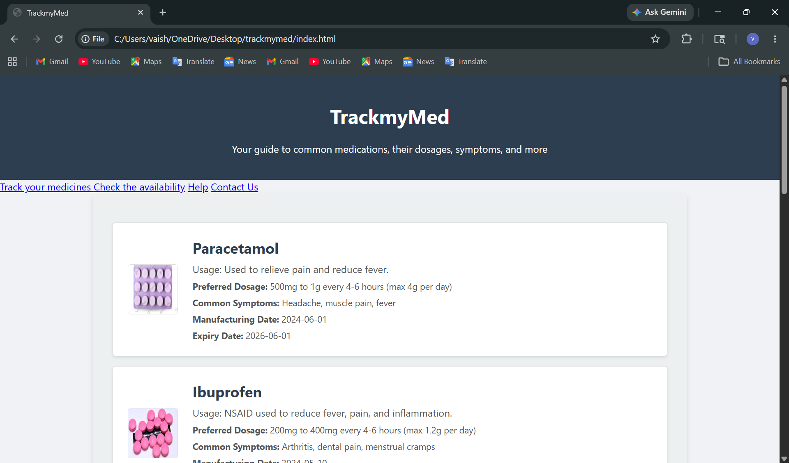
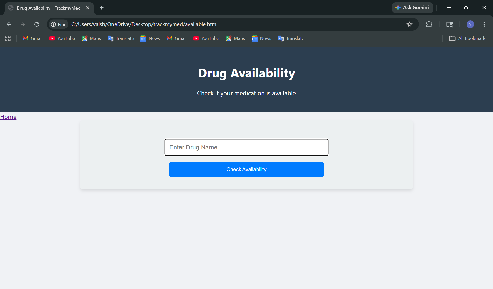
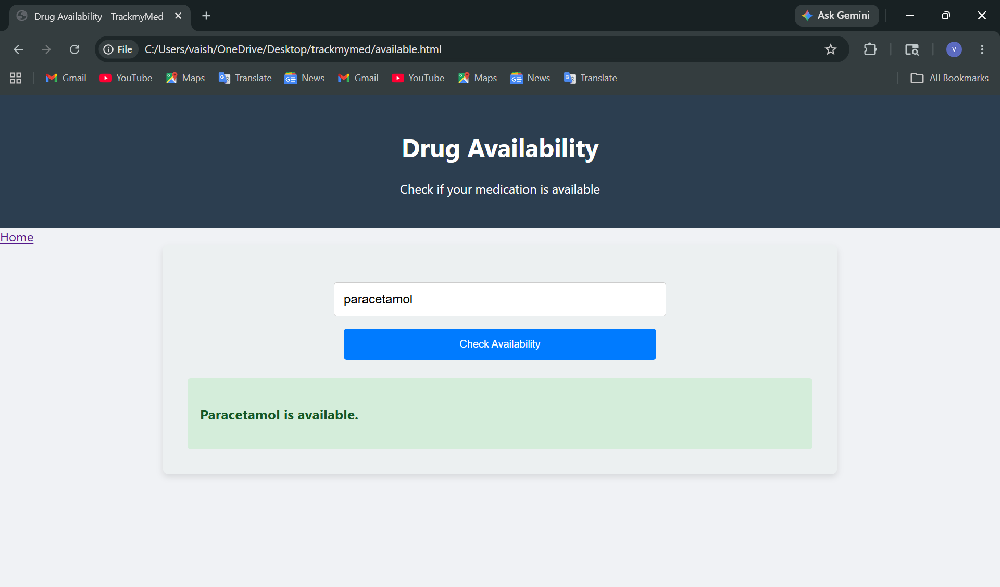
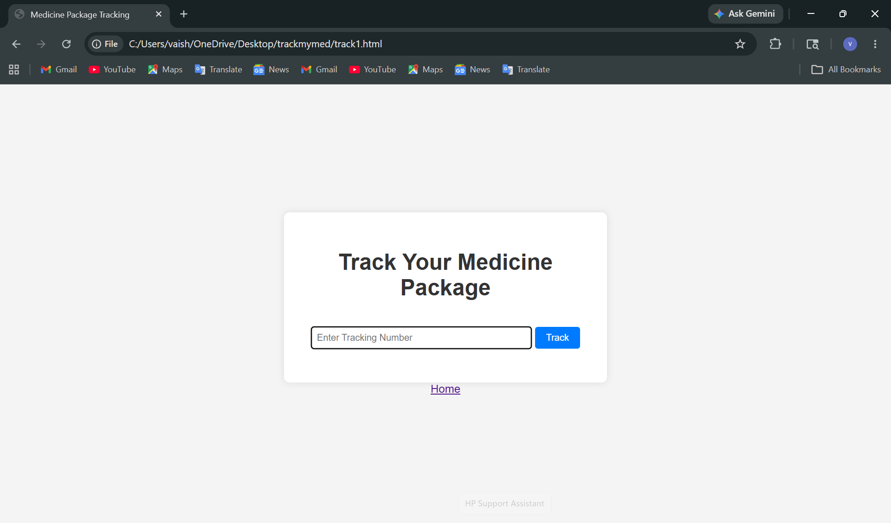
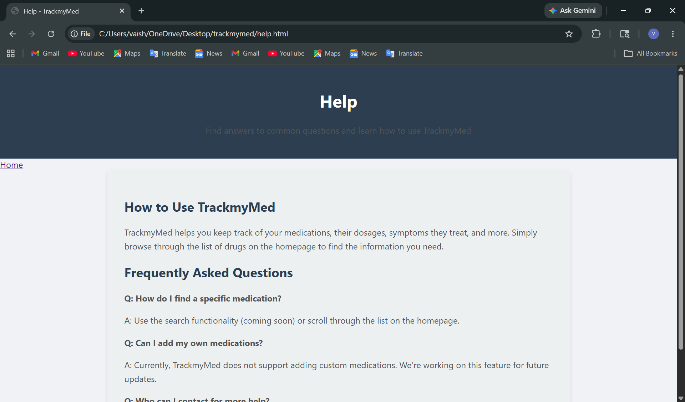
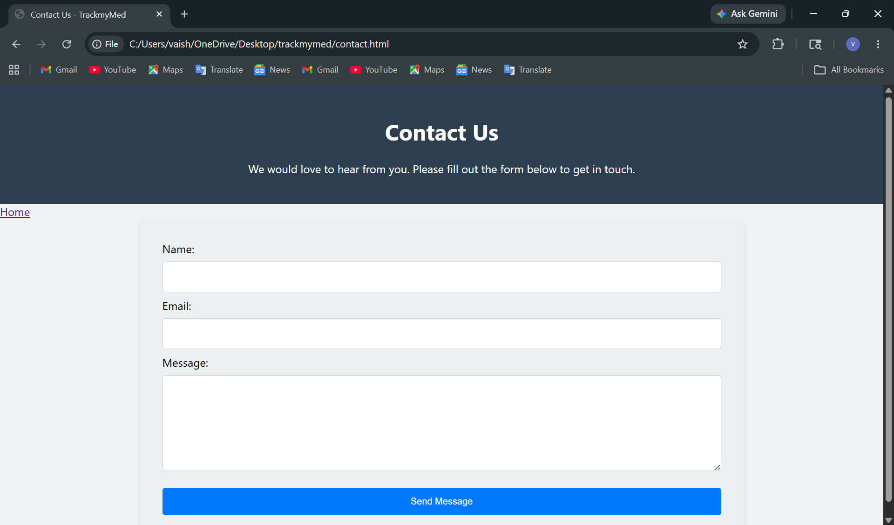

# 💊 TrackMyMed

TrackMyMed is a web-based healthcare application designed to help users access medication information, check availability, and track medicine packages.

## Features

- Browse medicine information
- View dosage and symptom details
- Check medicine availability
- Track medicine packages
- Access help and support resources

## Technologies Used

- HTML
- CSS
- JavaScript

## Screenshots

### Homepage

### Drug Availability Search

### Availability Result

### Package Tracking

### Help Center

### Contact Page

## Future Improvements

- Blockchain integration
- QR code verification
- Hospital inventory management
- Pharmacy network integration
- Counterfeit medicine detection
